<div align="center">
  <h1>🚀 Sidifensen Blog</h1>
  <p>现代化社区系统 | 前后端分离架构</p>

[](https://www.java.com/)
[](https://spring.io/projects/spring-boot)
[](https://vuejs.org/)
[](https://element-plus.org/)

  <p>
    <a href="#-功能特性">功能特性</a> •
    <a href="#-技术架构">技术架构</a> •
    <a href="#-快速开始">快速开始</a> •
    <a href="#-部署指南">部署指南</a> •
    <a href="#-项目结构">项目结构</a>
  </p>
</div>

---

<div align="center">

**🌐 官网地址**: [https://www.sidifensen.com](https://www.sidifensen.com)

**🔧 后台管理**: [https://admin.sidifensen.com](https://admin.sidifensen.com)

**📦 Gitee 仓库**: [https://gitee.com/sidifensen/sidifensen_blog](https://gitee.com/sidifensen/sidifensen_blog)

**💻 GitHub 仓库**: [https://github.com/sidifensen/sidifensen_blog](https://github.com/sidifensen/sidifensen_blog)

</div>

---

## 📋 项目概述

**Sidifensen Blog** 是一个功能完整的现代化社区系统，采用前后端分离架构设计。系统包含用户端展示界面和管理端后台系统，提供了从内容创作到用户交互的完整社区解决方案。

### ✨ 项目亮点

- 🎨 **现代化 UI**: 基于 Element Plus 的精美界面设计
- 🔒 **安全可靠**: Spring Security + JWT 认证，阿里云内容安全检测
- ⚡ **高性能**: Redis 缓存 + RabbitMQ 异步处理
- 🤖 **AI 赋能**: DeepSeek API 提供摘要、标题生成、标签推荐、评论回复建议与流式智能客服，全面提升创作与互动效率
- 💎 **VIP 会员**: 完整的会员体系 + 套餐管理 + 支付对接（支付宝沙箱环境）+ AI 配额管理
- 💬 **实时通信**: WebSocket 私信系统，支持消息撤回、已读状态、正在输入状态显示
- 🔔 **通知中心**: 实时消息通知，点赞、评论、关注、收藏全面追踪
- 📱 **响应式设计**: 完美适配桌面端和移动端
- 📱 **微信小程序**: UniApp 多端支持，可编译为微信小程序、H5 等多平台
- 🔧 **易于扩展**: 模块化架构，支持功能定制
- 🚀 **开箱即用**: Docker 一键部署，快速上线
- 🤖 **自动化部署**: Jenkins + Gitea CI/CD 自动化构建和部署

## 🛠️ 技术架构

<table>
<tr>
<td valign="top" width="50%">

### 🔧 后端技术栈

- **核心框架**: Spring Boot 3.4.0
- **开发语言**: Java 21
- **安全框架**: Spring Security 6.4.1 + JWT
- **实时通信**: Spring WebSocket 6.4.1
- **数据库**: MySQL 8.1.0
- **ORM 框架**: MyBatis-Plus 3.5.14
- **缓存中间件**: Redis 3.4.0
- **消息队列**: RabbitMQ 3.4.0
- **文件存储**: MinIO 8.3.6
- **模板引擎**: Thymeleaf 3.4.0
- **邮件服务**: Spring Mail
- **第三方登录**: JustAuth 1.16.7
- **内容安全**: 阿里云图片内容检测 2.0.6
- **AI 能力**: Spring AI 1.0.0 + DeepSeek API
- **监控运维**: Spring Actuator
- **切面编程**: Spring AOP
- **工具库**:
  - Lombok 1.18.38 (代码简化)
  - Hutool 5.8.38 (Java 工具库)
  - FastJSON 2.0.50 (JSON 处理)
  - Easy-Captcha 1.6.2 (验证码生成)

</td>
<td valign="top" width="50%">

### 🎨 前端技术栈

#### 用户端

- **核心框架**: Vue 3.5.13
- **构建工具**: Vite 6.2.4
- **移动端支持**: Capacitor (iOS/Android 原生打包)
- **UI 组件库**: Element Plus 2.10.2
- **状态管理**: Pinia 3.0.1 + 持久化插件
- **路由管理**: Vue Router 4.5.0
- **HTTP 客户端**: Axios 1.10.0
- **样式预处理**: Sass Embedded 1.89.2
- **图标库**: Element Plus Icons 2.3.1 + SVG Icons
- **富文本编辑器**: AiEditor 1.4.0
- **工具库**: VueUse 13.5.0

#### 管理端（额外功能）

- **数据可视化**: ECharts 5.6.0
- **Excel 处理**: XLSX 0.18.5
- **文件保存**: FileSaver 2.0.5

#### 微信小程序端

- **核心框架**: UniApp + Vue 3
- **状态管理**: Pinia
- **UI 组件**: uView UI
- **样式预处理**: SCSS
- **构建工具**: Vite

#### 开发工具

- **代码混淆**: Vite Plugin Obfuscator
- **安全防护**: Disable DevTool 0.3.9
- **自动导入**: unplugin-auto-import + unplugin-vue-components
- **开发调试**: Vue DevTools 7.7.2

</td>
</tr>
</table>

## 📁 项目结构

```
sidifensen_blog/
├── script/                                         # 部署脚本和配置
│   ├── prod/                                       #   生产环境配置
│   │   ├── jenkins/                                #     Jenkins CI/CD 配置
│   │   ├── ssl/                                    #     HTTPS SSL 证书配置
│   │   └── dev/                                    #     Docker Compose 配置
│   └── dev/                                        #   开发环境配置
│
├── sidifensen_blog_backend/                        # 后端服务 (Spring Boot + Java 21)
│   └── src/main/java/com/sidifensen/
│       ├── aspect/                                 #   AOP 切面
│       ├── config/                                 #   配置类
│       ├── controller/                             #   REST API 控制器
│       ├── domain/                                 #   数据模型 (entity/dto/vo/enums)
│       ├── exception/                              #   全局异常处理
│       ├── handler/                                #   处理器
│       ├── mapper/                                 #   MyBatis-Plus 数据访问
│       ├── minio/                                  #   MinIO 对象存储
│       ├── rabbitmq/                               #   RabbitMQ 消息队列
│       ├── redis/                                  #   Redis 缓存
│       ├── security/                               #   Spring Security + JWT
│       ├── service/impl/                           #   业务逻辑服务
│       ├── task/                                   #   定时任务
│       ├── utils/                                  #   通用工具类
│       └── websocket/                              #   WebSocket 实时通信
│
├── sidifensen_blog_frontend/                       # 前端应用 (Vue 3 + Vite)
│   ├── sidifensen_admin/                           #   管理端后台
│   │   └── src/
│   │       ├── api/                                #     API 接口
│   │       ├── assets/                             #     静态资源
│   │       ├── components/                         #     可复用组件
│   │       ├── router/                             #     路由配置
│   │       ├── stores/                             #     Pinia 状态管理
│   │       ├── utils/                              #     工具函数
│   │       └── views/                              #     页面组件
│   │
│   └── sidifensen_user/                            #   用户端前台
│       └── src/
│           ├── api/                                #     API 接口
│           ├── assets/                             #     静态资源
│           ├── components/                         #     可复用组件
│           ├── router/                             #     路由配置
│           ├── stores/                             #     Pinia 状态管理
│           ├── utils/                              #     工具函数
│           └── views/                              #     页面组件
│
├── sidifensen_blog_miniprogram/                      # 微信小程序端 (UniApp)
├── sql/                                            # 数据库初始化脚本
│   ├── console.sql                                 #   控制台 SQL
│   └── sidifensen_blog.sql                         #   完整数据库结构
│
└── img/                                            # 项目截图
```

## ⭐ 功能特性

<table>
<tr>
<td valign="top" width="50%">

### 🔐 用户系统

- **多种登录方式**: 账号密码 + 第三方 OAuth 登录 (GitHub, Gitee)
- **权限管理**: 基于角色的访问控制 (RBAC)
- **安全防护**: JWT 认证 + Spring Security
- **邮件验证**: 注册验证码 + 密码重置 + 邮箱修改
- **图形验证码**: 防止恶意注册和登录
- **用户主页**: 个人主页展示 + 关注/粉丝系统
- **创作中心**: 文章管理 + 专栏管理 + 评论管理
- **私信功能**: WebSocket 实时聊天 + 消息通知 + 会话管理 + 正在输入状态显示
- **通知中心**: 系统通知 + 互动提醒（点赞、评论、关注、收藏）+ 消息统一管理
- **VIP 会员**: 会员套餐购买 + 支付宝支付 + 会员有效期管理 + AI 配额权益

### 📝 内容管理

- **富文本编辑**: 支持 Markdown + 所见即所得编辑 (AiEditor)
- **文章系统**: 文章发布 + 草稿箱 + 回收站 + 审核机制
- **专栏系统**: 专栏创建 + 文章分类管理
- **标签系统**: 文章标签 + 标签管理
- **图片管理**: MinIO 对象存储 + 图片安全检测
- **内容审核**: 阿里云内容安全自动审核
- **AI 写作助手**: 摘要提取、标题生成、标签推荐、评论回复建议 + 配额与限流
- **SEO 优化**: 友好的 URL 结构和 Meta 信息
- **VIP 会员专区**: 会员专属文章 + 付费内容查看权限

### 🎨 用户界面

- **响应式设计**: 完美适配桌面、平板、手机
- **微信小程序**: UniApp 多端支持（微信小程序、H5）
- **暗黑模式**: 支持明暗主题切换
- **加载动画**: 优雅的加载和过渡效果
- **无限滚动**: 流畅的内容浏览体验
- **搜索功能**: 全文搜索和标签筛选
- **用户交互**: 点赞 + 收藏 + 评论 + 关注 + 私信
- **历史记录**: 浏览历史
- **实时通信**: WebSocket 私信聊天 + 在线状态 + 正在输入状态显示
- **通知中心**: 实时通知提醒 + 分类筛选（系统/点赞/评论/关注/收藏）+ 消息已读管理

</td>
<td valign="top" width="50%">

### 🔧 管理后台

- **仪表盘**: 数据统计和系统监控 + ECharts 图表展示
- **用户管理**: 用户列表、角色权限管理、黑名单管理
- **内容管理**: 文章审核、评论管理、标签管理
- **文件管理**: 图片审核、相册管理、批量操作
- **系统管理**: 菜单管理、权限管理、角色管理
- **日志管理**: 登录日志、访问日志、操作记录
- **系统设置**: 站点配置、邮件配置、安全设置
- **VIP 管理**: 会员套餐配置、订单管理、会员状态查询

### ⚡ 性能优化

- **Redis 缓存**: 热点数据缓存，提升响应速度
- **异步处理**: RabbitMQ 消息队列处理耗时任务
- **定时任务**: 热门文章统计、数据清理
- **代码分割**: 前端代码按需加载
- **图片优化**: 图片压缩和懒加载
- **AOP 切面**: 统一日志记录和性能监控
- **智能限流**: API 限流保护，防止滥用（摘要：10 分钟 5 次；标题/标签：每小时 10 次；评论回复：每小时 15 次）

### 🚀 部署运维

- **Docker 支持**: 一键容器化部署 + Docker Compose 编排
- **CI/CD 自动化**: Jenkins Pipeline 自动化构建和部署
- **私有代码仓库**: Gitea 私有 Git 仓库支持
- **Webhook 触发**: 代码推送自动触发部署流程
- **多环境配置**: 开发、测试、生产环境分离
- **SSL 支持**: HTTPS 证书配置和自动续期
- **日志管理**: 结构化日志记录和分析
- **监控告警**: 应用性能监控
- **备份恢复**: 数据库自动备份机制
- **Windows 支持**: 提供 Windows 批处理脚本

</td>
</tr>
</table>

## 🚀 快速开始

### 📋 环境要求

| 组件              | 版本要求                     | 说明              |
| ----------------- | ---------------------------- | ----------------- |
| ☕ JDK            | 21+                          | 后端运行环境      |
| 🟢 Node.js        | 18+                          | 前端构建环境      |
| 🐬 MySQL          | 8.0+                         | 主数据库          |
| 🔴 Redis          | 6.0+                         | 缓存数据库        |
| 🐰 RabbitMQ       | 3.8+                         | 消息队列          |
| ☁️ MinIO          | RELEASE.2025-04-08T15-41-24Z | 对象存储          |
| 🐳 Docker         | 20.0+                        | 容器化部署 (推荐) |
| 🐳 Docker Compose | 1.29+                        | 容器编排          |

### 💾 数据库初始化

```bash
# 1. 创建数据库
mysql -u root -p
CREATE DATABASE sidifensen_blog CHARACTER SET utf8mb4 COLLATE utf8mb4_unicode_ci;

# 2. 导入数据结构
mysql -u root -p sidifensen_blog < sql/sidifensen_blog.sql
```

> 💡 **提示**: 如果使用 Docker Compose 部署，数据库会自动初始化，无需手动执行以上步骤。

### 🔧 后端启动

#### 传统方式启动

```bash
# 克隆项目
git clone https://github.com/sidifensen/sidifensen_blog.git
cd sidifensen_blog/sidifensen_blog_backend

# 复制环境配置文件
cp .env.example .env

# 配置数据库连接
# 编辑 .env 文件
# 修改数据库、Redis、RabbitMQ、MinIO 等连接信息

# 方式一：使用 dotenv 加载 .env 文件启动（推荐）
# 需要先安装 dotenv-cli: npm install -g dotenv-cli
mvn clean install
dotenv -- mvn spring-boot:run

# 方式二：直接启动（不加载 .env 文件）
mvn clean install
mvn spring-boot:run

# 或者使用 IDE 直接运行 SidifensenBlogBackendApplication.java
```

#### Docker Compose 方式启动（推荐）

```bash
# 克隆项目
git clone https://github.com/sidifensen/sidifensen_blog.git
cd sidifensen_blog

# 复制环境配置文件
# Windows:
copy script\dev\.env.example .env
# Linux/Mac:
# cp script/dev/.env.example .env

# 根据需要修改 .env 文件中的配置
# vim .env

# 启动所有服务
# Windows:
cd script && dev\start.bat
# Linux/Mac:
# cd script && dev/start.sh
```

#### 一键启动脚本

项目提供了便捷的启动脚本：

- **Windows**: `script/dev/start.bat` - Windows 批处理脚本，支持环境检查、服务启动、日志查看等功能
- **Linux/Mac**: `script/dev/start.sh` - Shell 脚本，提供相同的功能

### 🎨 前端启动

#### 传统方式启动

```bash
# 用户端启动
cd sidifensen_blog_frontend/sidifensen_user
npm install
npm run dev
# 访问 http://localhost:5173

# 管理端启动 (新开终端)
cd sidifensen_blog_frontend/sidifensen_admin
npm install
npm run dev
# 访问 http://localhost:5174
```

#### Docker Compose 方式启动（推荐）

使用 Docker Compose 启动时，前端应用会自动构建并启动，无需手动执行以下步骤。

### 🌐 访问应用

启动成功后，可通过以下地址访问：

#### 传统方式启动

- 📱 **用户端**: http://localhost:5173 (社区前台)
- 🔧 **管理端**: http://localhost:5174 (后台管理)
- 🔌 **后端 API**: http://localhost:8080 (REST API)

#### Docker Compose 方式启动（推荐）

- 📱 **用户端**: http://localhost:7000 (社区前台)
- 🔧 **管理端**: http://localhost:8000 (后台管理)
- 🔌 **后端 API**: http://localhost:5000 (REST API)
- ☁️ **MinIO 控制台**: http://localhost:9001 (对象存储管理)
- 🐰 **RabbitMQ 控制台**: http://localhost:15672 (消息队列管理)

> 💡 **提示**: 默认端口可以在 `.env` 文件中修改。

## 🐳 部署指南

### 🤖 自动化部署（推荐）

项目支持 **Jenkins + Gitea** 自动化 CI/CD 部署方案，实现代码推送后自动构建和部署。

#### 方案特点

- ✅ **一键安装**: 提供自动化脚本快速安装 Jenkins 和 Gitea
- ✅ **自动触发**: 代码推送到 Gitea 后自动触发 Jenkins 构建
- ✅ **完整流程**: 自动构建后端、前端，并部署到服务器
- ✅ **私有仓库**: 使用 Gitea 搭建私有 Git 仓库，代码安全可控
- ✅ **Webhook 集成**: Gitea Webhook 自动触发 Jenkins Pipeline

#### 快速开始

1. **部署 Gitea 私有仓库**

   ```bash
   cd script/prod/jenkins
   cp .env.example .env
   # 编辑 .env 文件，配置服务器 IP 等信息
   docker-compose -f docker-compose-gitea.yml --env-file .env up -d
   ```

2. **安装 Jenkins**

   ```bash
   cd script/prod/jenkins
   chmod +x jenkins-setup.sh
   sudo ./jenkins-setup.sh
   ```

3. **配置 Jenkins 和 Gitea**

   详细配置步骤请参考：
   - [自动化部署快速指南](./script/prod/jenkins/README.md)
   - [Jenkins 部署详细指南](./script/prod/jenkins/Jenkins 部署指南.md)
   - [Gitea 配置详细指南](./script/prod/jenkins/Gitea 配置指南.md)

4. **创建 Jenkins 任务并配置 Webhook**

   按照文档完成 Jenkins Pipeline 任务配置和 Gitea Webhook 设置。

5. **推送代码自动部署**

   ```bash
   # 添加 Gitea 远程仓库
   git remote add gitea http://your-server-ip:3000/username/sidifensen_blog.git

   # 推送代码，自动触发部署
   git push gitea main
   ```

#### 工作流程

```
本地开发 → git push → Gitea 仓库 → Webhook 触发 → Jenkins Pipeline
  ↓
自动构建后端 (Maven) → 自动构建前端 (Node.js) → 自动部署到服务器
  ↓
Docker 容器重启 → 服务更新完成
```

> 💡 **提示**: 自动化部署方案适合生产环境，可以显著提升部署效率和代码安全性。详细配置请查看 `script/prod/jenkins/` 目录下的文档。

---

### 🔧 生产环境部署（传统方式）

#### 💻 服务器配置要求

**最低配置**：

- CPU: 2 核
- 内存：4GB
- 存储：20GB（建议 SSD）

**推荐配置**（本项目实际运行环境）：

- CPU: 4 核
- 内存：8GB
- 带宽：5Mbps
- 存储：40GB SSD

> 💡 **提示**:
>
> - docker 部署需要 4g 内存

#### 1️⃣ 环境准备

```bash
# 安装 Docker 和 Docker Compose
curl -fsSL https://get.docker.com -o get-docker.sh
sudo sh get-docker.sh

# 安装 Docker Compose
sudo curl -L "https://github.com/docker/compose/releases/download/v2.0.1/docker-compose-$(uname -s)-$(uname -m)" -o /usr/local/bin/docker-compose
sudo chmod +x /usr/local/bin/docker-compose
```

#### 2️⃣ 使用 Docker Compose 一键部署（推荐）

```bash
# 克隆项目
git clone https://github.com/sidifensen/sidifensen_blog.git
cd sidifensen_blog

# 复制环境配置文件（生产环境）
# Linux/Mac:
cp script/prod/.env.example .env
# Windows:
# copy script\prod\.env.example .env

# 根据生产环境修改 .env 文件中的配置
vim .env

# 一键启动所有服务
# Linux/Mac:
cd script/prod && ./start.sh
```

#### 3️⃣ SSL 证书配置（可选）

项目支持 HTTPS 部署，提供了 SSL 证书配置：

```bash
# 进入生产环境配置目录
cd script/prod

# 复制 SSL 环境配置
cp .env.example .env

# 配置 SSL 证书信息
vim .env

# 启动 SSL 版本
./start.sh
```

#### 4️⃣ 传统方式部署

##### 后端部署

```bash
cd sidifensen_blog_backend

# 1. 复制并修改环境配置文件
cp .env.example .env
vim .env

# 2. 构建 JAR 包
mvn clean package -DskipTests

# 3. 运行 JAR 包
java -jar target/sidifensen_blog_backend-1.0-SNAPSHOT.jar

# 或使用 Docker Compose 部署（推荐）
cd ../script/prod
docker-compose up -d --build
```

##### 前端部署

```bash
# 用户端
cd sidifensen_blog_frontend/sidifensen_user
npm install
npm run build

# 管理端
cd sidifensen_blog_frontend/sidifensen_admin
npm install
npm run build

# 或使用 Docker Compose 统一部署（推荐）
cd script/prod
docker-compose up -d --build
```

### 🌐 访问地址

部署完成后，可通过以下地址访问：

| 服务        | 地址                     | 说明          |
| ----------- | ------------------------ | ------------- |
| 📱 用户端   | http://your-domain:7000  | 社区前台展示  |
| 🔧 管理端   | http://your-domain:8000  | 后台管理系统  |
| 🔌 后端 API | http://your-domain:5000  | REST API 接口 |
| ☁️ MinIO    | http://your-domain:9001  | 对象存储管理  |
| 🐰 RabbitMQ | http://your-domain:15672 | 消息队列管理  |

### ⚙️ 配置说明

**重要配置项：**

- 数据库连接信息
- Redis 连接配置
- RabbitMQ 连接配置
- MinIO 存储配置
- 阿里云内容安全配置
- 邮件服务配置
- OAuth 第三方登录配置
- DeepSeek AI 配置（文章摘要功能）

> 💡 **提示**: 所有配置项也可以在 `.env` 文件中修改，详细说明请参考：
> - 开发环境：`script/dev/.env.example`
> - 生产环境：`script/prod/.env.example`

## 📸 项目截图展示

### 🏠 首页

<div align="center">

**社区首页 - 欢迎页面**

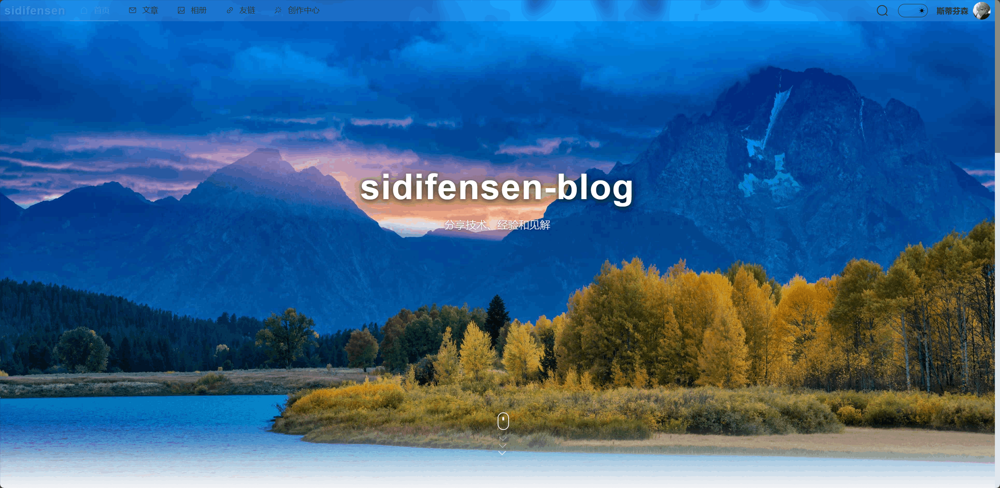

</div>

### 📝 文章系统

<div align="center">

**文章列表页面**

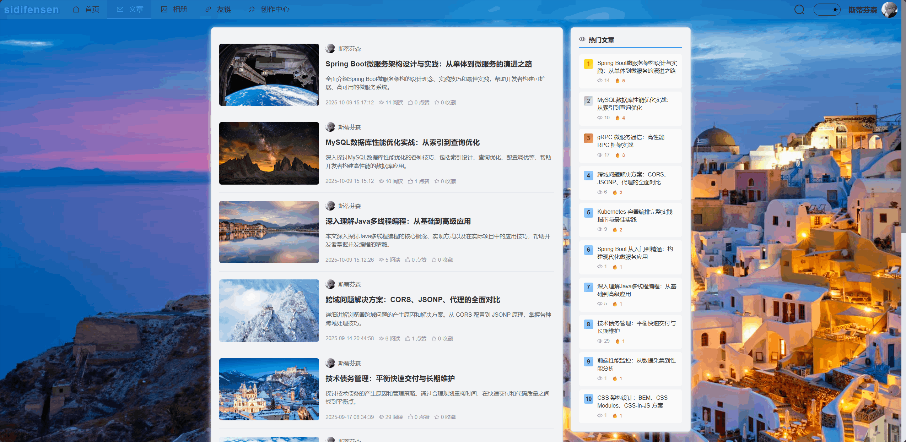

**文章搜索结果页面**

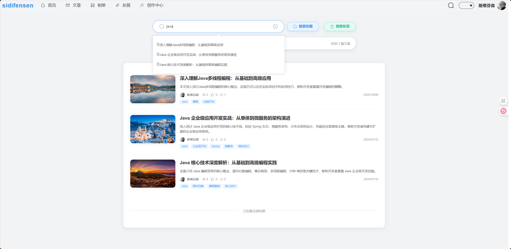

</div>

### 📸 相册系统

<div align="center">

**相册广场页面**

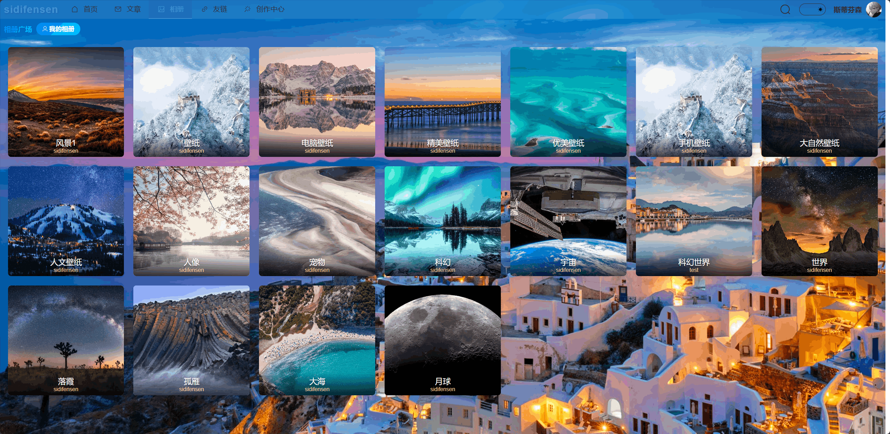

</div>

### 🔗 友链系统

<div align="center">

**友情链接页面**

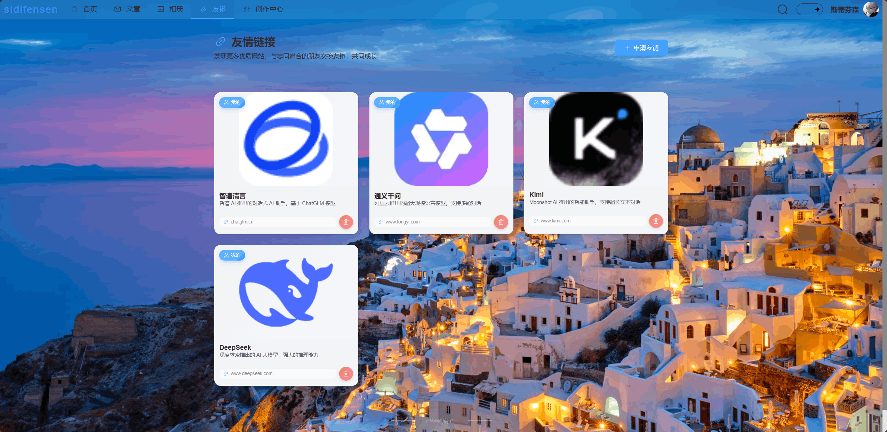

</div>

### 🎨 创作中心

<div align="center">

**创作中心 - 首页**

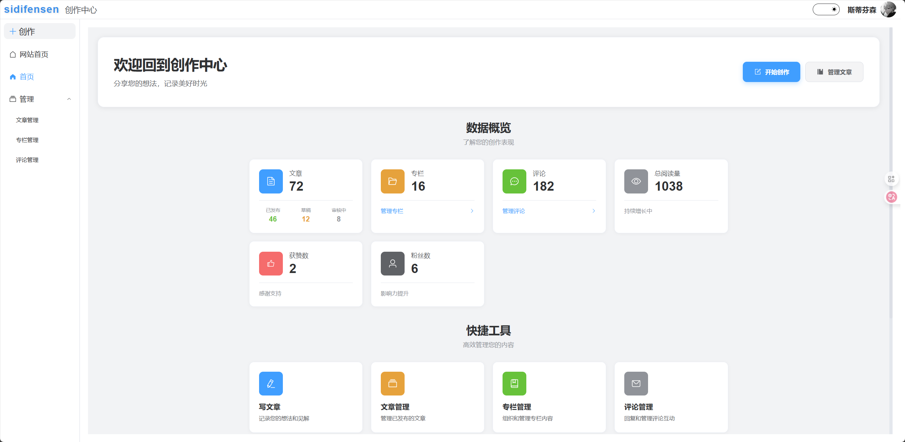

**创作中心 - 文章管理**

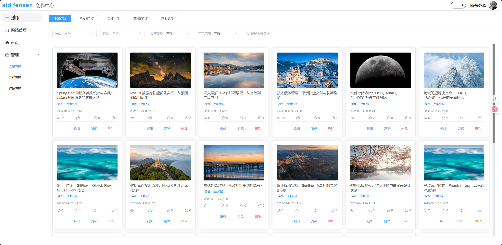

**创作中心 - 专栏管理**

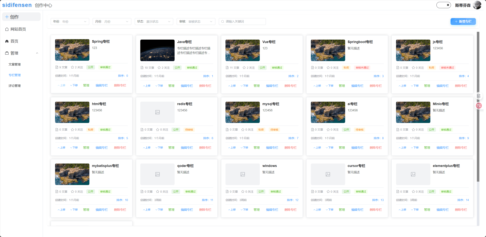

**创作中心 - 评论管理**

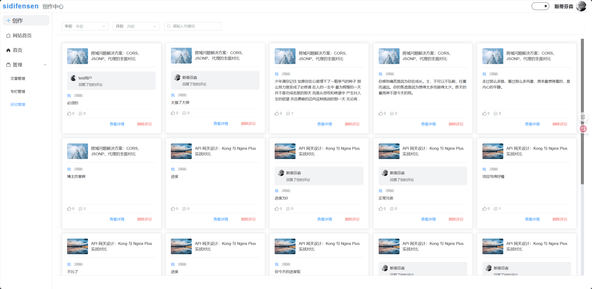

</div>

### 👤 个人主页

<div align="center">

**个人主页 - 文章展示**

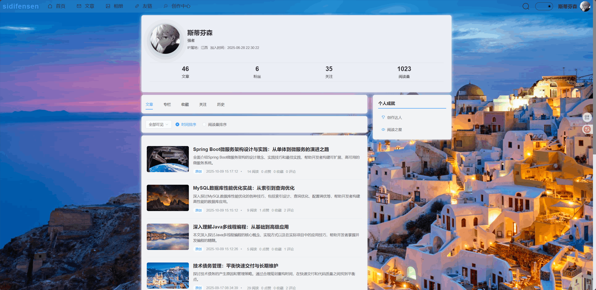

**个人主页 - 专栏展示**


**个人主页 - 收藏内容**

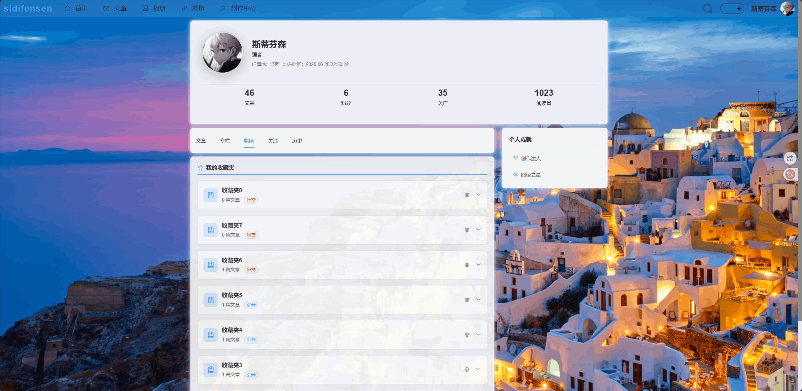

**个人主页 - 关注/粉丝**

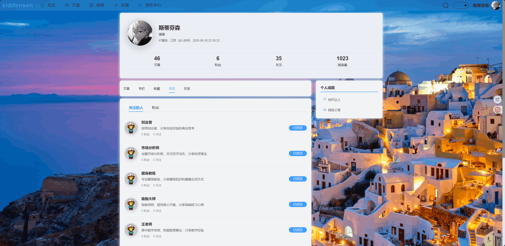

**个人主页 - 历史记录**

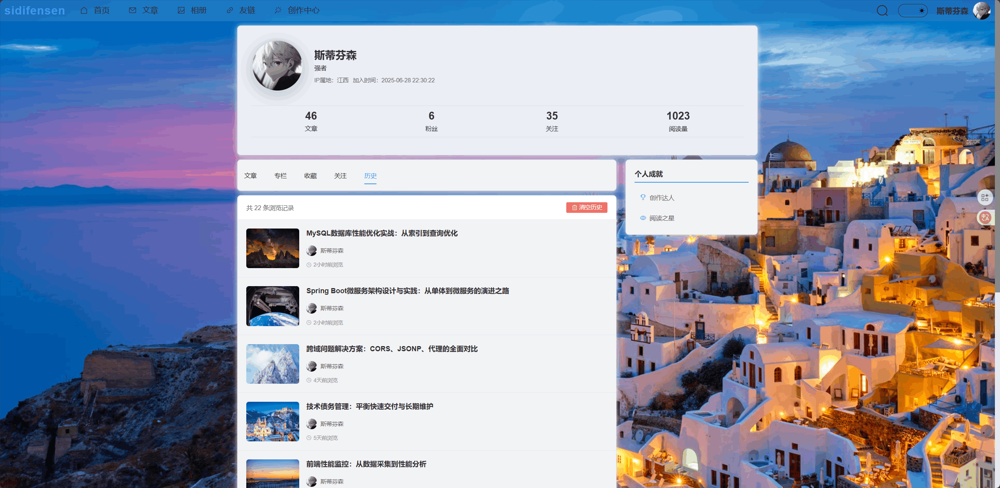

</div>

### 🔧 管理后台

<div align="center">

**管理后台首页 - 数据统计仪表盘**

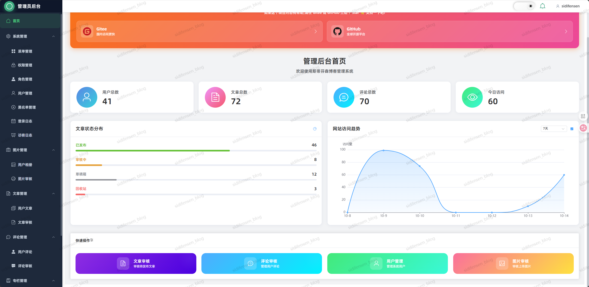

**系统管理 - 菜单管理页面**

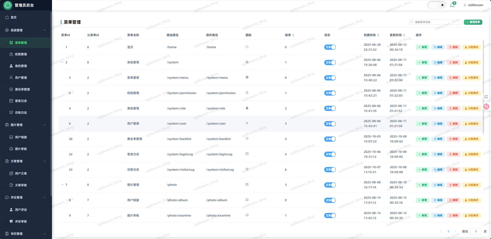

**文章管理 - 文章审核页面**

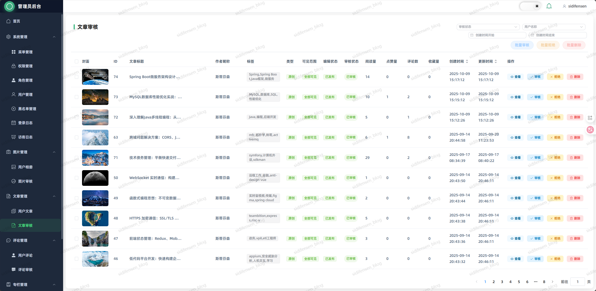

</div>

## 🤝 贡献指南

我们欢迎所有形式的贡献！请遵循以下步骤：

### 📝 提交流程

1. **Fork 项目** 到你的 GitHub 账号
2. **创建特性分支**: `git checkout -b feature/amazing-feature`
3. **提交更改**: `git commit -m 'Add some amazing feature'`
4. **推送分支**: `git push origin feature/amazing-feature`
5. **创建 Pull Request**

### 🐛 问题报告

发现 Bug 或有新功能建议？请通过 [Gitee Issues](https://gitee.com/sidifensen/sidifensen_blog/issues) 或 [GitHub Issues](https://github.com/sidifensen/sidifensen_blog/issues) 提交。

**Bug 报告请包含：**

- 🔍 详细的问题描述
- 🔄 重现步骤
- 💻 运行环境信息
- 📸 截图或错误日志

## 📅 后续计划

我们正在积极开发新功能，以下是即将推出的特性：

### ✅ 已完成功能

- [x] **📊 操作日志系统**
  - ✅ 用户操作记录与追踪
  - ✅ 管理员操作日志查看
  - ✅ 日志检索与导出功能
  - ✅ 关键操作审计追踪

- [x] **📈 Dashboard 仪表盘重构**
  - ✅ 数据统计可视化（ECharts）
  - ✅ 实时数据更新
  - ✅ 核心指标卡片展示
  - ✅ 系统状态监控

- [x] **🔐 OAuth 登录流程重构**
  - ✅ Gitee/GitHub/QQ 第三方登录支持
  - ✅ OAuth 回调处理优化
  - ✅ 用户信息绑定与自动注册
  - ✅ 登录状态持久化

- [x] **💬 私信功能**
  - ✅ 用户之间一对一私信交流
  - ✅ 消息已读/未读状态
  - ✅ 消息列表和会话管理
  - ✅ 实时消息推送（WebSocket）
  - ✅ 消息撤回和删除
  - ✅ 用户在线状态显示
  - ✅ 正在输入状态显示

- [x] **🔔 通知中心**
  - ✅ 系统通知推送
  - ✅ 点赞、评论、关注、收藏互动提醒
  - ✅ 消息中心统一管理
  - ✅ 通知分类筛选和已读管理
  - ✅ 实时未读数量提示

- [x] **💎 VIP 会员体系**
  - ✅ 会员套餐管理（多种套餐配置）
  - ✅ 支付宝支付对接（PC 端 + H5）
  - ✅ 订单管理（创建、查询、异步回调）
  - ✅ 会员有效期管理
  - ✅ AI 配额与权益绑定
  - ✅ 支付结果页状态轮询
  - ✅ 沙箱环境支持

- [x] **🎨 前端开发规范更新**
  - ✅ 去 AI 味设计指南
  - ✅ 黑夜模式适配规范
  - ✅ Docker 配置优化

### 🚧 计划中的功能

- [ ] **📊 数据统计增强**
  - [ ] 用户行为分析（PV/UV、停留时长）
  - [ ] 文章阅读趋势图表
  - [ ] 热门搜索词统计

- [ ] **🎯 推荐系统**
  - [ ] 基于用户兴趣的文章推荐
  - [ ] 相关内容智能推荐
  - [ ] 热门内容排行优化

- [ ] **📱 移动端优化**
  - [ ] PWA 支持
  - [ ] 移动端手势优化
  - [ ] 离线缓存

- [ ] **🔍 搜索增强**
  - [ ] 全文搜索引擎（Elasticsearch）
  - [ ] 搜索联想与纠错
  - [ ] 搜索结果高亮优化

> 💡 **提示**: 如果你对这些功能有建议或想法，欢迎在 [Gitee Issues](https://gitee.com/sidifensen/sidifensen_blog/issues) 或 [GitHub Issues](https://github.com/sidifensen/sidifensen_blog/issues) 中讨论！

## 📄 许可证

本项目基于 [MIT License](LICENSE) 开源协议。

### 🌟 如果这个项目对你有帮助，请给一个 Star ⭐

**💡 这是一个设计精良、功能完整的现代化社区系统，适合：**

- 🎓 学习 Spring Boot + Vue 3 全栈开发
- 🚀 快速搭建社区平台
- 📚 作为企业级项目开发参考
- 🔧 二次开发和功能扩展

## 💬 交流群

<div align="center">

**欢迎加入 QQ 交流群，一起学习讨论！**


</div>

</div>
