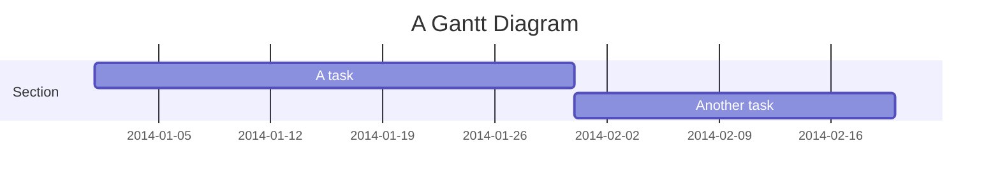
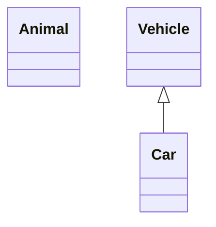
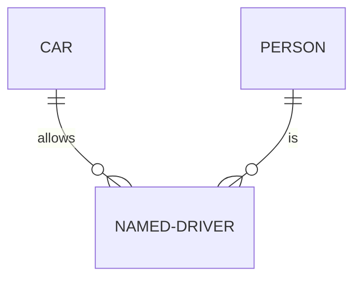
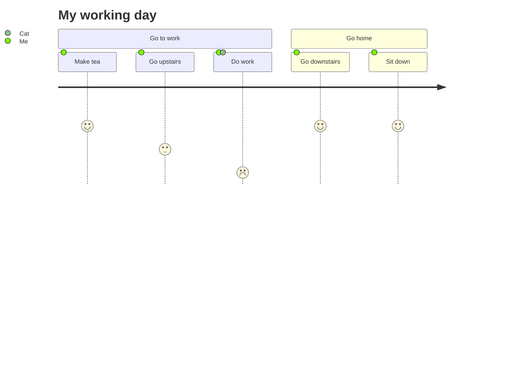

## 这是一篇测试文章
> 你看见这篇文章说明后台发布文章功能成功



### 图表

| col | col | col | col |
| - | - | - | - |
| content | content | content | content |
| content | content | content | content |
| content | content | content | content |




##### ElasticSearch

- 依赖和配置类和环境搭建

```java
// 依赖
<dependency>
            <groupId>org.springframework.boot</groupId>
            <artifactId>spring-boot-starter-data-elasticsearch</artifactId>
 </dependency>
// 配置类
   elasticsearch:
    uris: 192.168.88.128:9200
    connection-timeout: 10000
    socket-timeout: 30s
```

- 索引(**映射实体类的数据**)z


